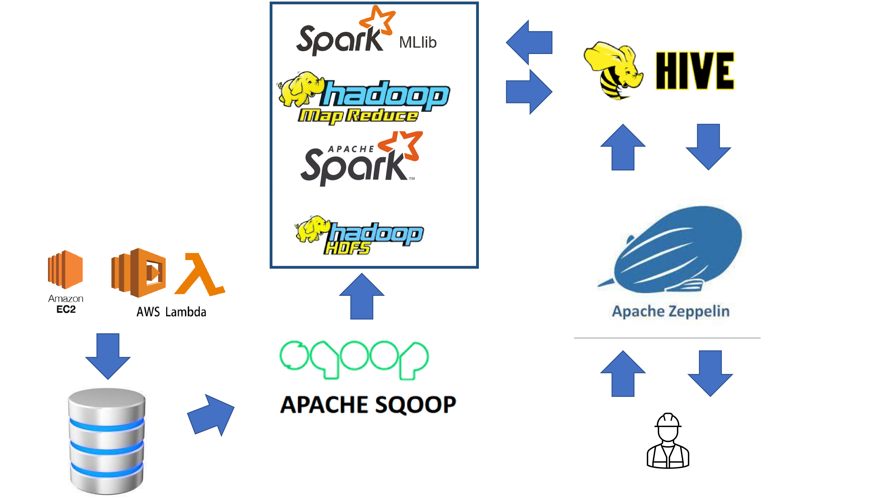

# 가짜 리뷰 필터링을 통한 여행 숙박업소 리뷰 빅 데이터 분석 시스템
# Travel accommodation review big data analysis system through fake review filtering

# 문제 정의
소비자의 87%가 방문하는 장소의 리뷰를 보고 코로나로 인해 리뷰 데이터의 중요성은 커졌다.
가짜 온라인 리뷰는 얼마든지 조작이 가능하고 이를 방지하고자 하는 플랫폼의 어뷰징 방지 정책에도 빈틈은 존재한다. 가짜 리뷰는 처음에는 좋지만 결국에는 독이 된다. 실제로 미국 UCLA 대학의 연구팀이 미국 아마존 데이터를 분석한 결과 초기에는 판매량이 증가하고 판매 순위가 평균 12.5% 상승했으나, 효과가 오래 가지 않았다. 오히려 판매자가 가짜 리뷰 작업을 멈추고 2달이 지나자 평균 평점은 6.3% 하락하고, 판매 순위는 기본 대비 21.5% 내려갔다는 분석 결과를 발표했다.

# 담당파트
|파트|사용 툴|이름|
|:---:|:---:|:---:|
|NLP, preprocessing|AWS, Apache Spark|김선민|
|NLP, preprocessing|Apache Spark, Sqoop|김현중|
|NLP, post-processing|Apache Mapreduce, Sqoop|권재성|
|NLP, post-processing, visualization|Apache Spark, Hive, Zeppelin|조형서|

# Technical Architecture
